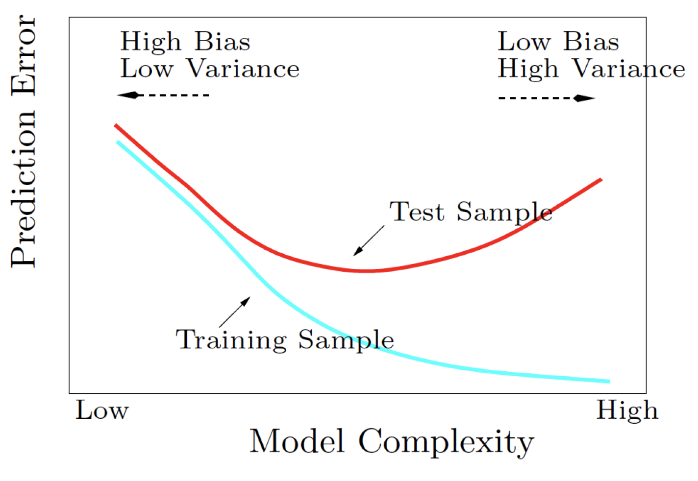

```{r setup, include=FALSE}
knitr::opts_chunk$set(echo = TRUE)
library(base)
library(tree)
library(MASS)
library(mda)
library(class)
library(e1071)
library(kernlab)
library(svmpath)
library(graphics)
library(ggplot2)
library(mclust)
library(stats)
library(cluster)
library(dplyr, warn.conflicts = T)
library(factoextra)
```

#Problem 1

###Data import
```{r}
getwd()

cancer <- read.table("Data-HW5-breastcancer.dat", header = T)
dim(cancer)
#str(cancer)
#summary(cancer)
table(cancer$y)
```

**Comment:**

It contains information on 569 FNAs. There are two diagnoses (classes): 212 malignant and 357 benign. So, "y = 0" stands for benign and "y = 1" stands for malignant.

$\\$

$\\$

###Part a) Partition the full data set into a training set of 400 patients, and a testing set of 169 patients. Please use the following command set.seed(1000) to set the random seed of your partition, so that you can reproduce all your analysis results.
```{r}
set.seed(1000)
samplesize <- 169
testid <- sample(seq_len(nrow(cancer)), samplesize, replace = F)

train <- cancer[-testid, ]
test <- cancer[testid, ]
dim(train)
dim(test)

#NA check
na <- c()
for(i in 1:ncol(cancer)){
  na[i] <- sum(is.na(cancer[,i]))
}
na
```

**Comment:**

If I sample 400 for training IDs, I will get different answers.

I randomly split into the 400 training and 169 testing sets. (I included the for loop of checking NA existence in our original data, just in case - good practice whenever you have a large data set)

$\\$

$\\$

###Part b) Fit LDA, QDA, MDA (with number of subclasses equal to (5, 5)), Nearest Neighbor (with k = 5), and CART. Report the misclassification error rate on the testing data set.
```{r}
set.seed(1000)
#LDA
ldas <- lda(train[,-1], train[,1]) #or, lda(y ~., data = cancer[trainid,])

trainpredict <- predict(ldas, train[,-1])$class #predict on the training set
#trainpredict

testpredict <- predict(ldas, test[,-1])$class #predict on the testing set
#testpredict


table(trainpredict, train[,1]) #confusion matrix of training 
table(testpredict, test[,1]) #confusion matrix of testing

ldatrainmis <- sum(trainpredict != train[,1]) / length(train[,1]) 
ldatestmis <- sum(testpredict != test[,1]) / length(test[,1])

paste("The misclassfication error rate on the training set for LDA is", round(ldatrainmis, 5))
paste("The misclassfication error rate on the testing set for LDA is", round(ldatestmis, 5))


#QDA
qdas <- qda(train[,-1], train[,1]) #or, qda(y ~., data = cancer[trainid,])

trainpredict2 <- predict(qdas, train[,-1])$class #predict on the training set
#trainpredict2

testpredict2 <- predict(qdas, test[,-1])$class #predict on the testing set
#testpredict2


table(trainpredict2, train[,1]) #confusion matrix of training 
table(testpredict2, test[,1]) #confusion matrix of testing

qdatrainmis <- sum(trainpredict2 != train[,1]) / length(train[,1]) 
qdatestmis <- sum(testpredict2 != test[,1]) / length(test[,1])

paste("The misclassfication error rate on the training set for QDA is", round(qdatrainmis, 5))
paste("The misclassfication error rate on the testing set for QDA is", round(qdatestmis, 5))


#MDA
mdas <- mda(y~., data = train, subclasses = c(5, 5)) 

trainpredict3 <- predict(mdas, train[,-1], type = "class") #predict on the training set
#trainpredict3

testpredict3 <- predict(mdas, test[,-1], type = "class") #predict on the testing set
#testpredict3


table(trainpredict3, train[,1]) #confusion matrix of training 
table(testpredict3, test[,1]) #confusion matrix of testing

mdatrainmis <- sum(trainpredict3 != train[,1]) / length(train[,1]) 
mdatestmis <- sum(testpredict3 != test[,1]) / length(test[,1])

paste("The misclassfication error rate on the training set for MDA is", round(mdatrainmis, 5))
paste("The misclassfication error rate on the testing set for MDA is", round(mdatestmis, 5))


#KNN with k = 5
k <- 5
trainpredict4 <- knn(train[,-1], train[,-1], train[,1], k = k)
#trainpredict4

testpredict4 <- knn(train[,-1], test[,-1], train[,1], k = k)
#testpredict4

table(trainpredict4, train[,1]) #confusion matrix of training 
table(testpredict4, test[,1]) #confusion matrix of testing

knntrainmis <- sum(trainpredict4 != train[,1]) / length(train[,1]) 
knntestmis <- sum(testpredict4 != test[,1]) / length(test[,1])

paste("The misclassfication error rate on the training set for KNN is", round(knntrainmis, 5))
paste("The misclassfication error rate on the testing set for KNN is", round(knntestmis, 5))


#CART (Classification And Regression Tree)
trees <- tree(as.factor(y) ~., data = train) #or, tree(as.factor(y) ~., data = cancer, subset = trainid)
trees

trainpredict5 <- predict(trees, newdata = train[,-1], type = "class")
#trainpredict5

testpredict5 <- predict(trees, newdata = test[,-1], type = "class")
#testpredict5

table(trainpredict5, train[,1]) #confusion matrix of training 
table(testpredict5, test[,1]) #confusion matrix of testing

treetrainmis <- sum(trainpredict5 != train[,1]) / length(train[,1]) 
treetestmis <- sum(testpredict5 != test[,1]) / length(test[,1])

paste("The misclassfication error rate on the training set for KNN is", round(treetrainmis, 5))
paste("The misclassfication error rate on the testing set for KNN is", round(treetestmis, 5))

plot(trees)
text(trees, pretty = 0)


```

**Comment:**

I again set the seed with 1000.

I reported the misclassification error rate both on the training and testing data set above. Also, please be aware that misclassification error rate on testing set is what is important. Training and testing on the same data set is not a good practice to do...

For tree, we need to go for classification tree, as the y is categorial consisted with 1 and 0 only.

Just for the readers, I made confusion matrixes for each method. (So, you can actually see the sensitivity and specificity)

As they asked me to report the misclassification error rate on the testing data set, I printed out the test error rate for each method. 

$\\$

$\\$

###Part c) Fit MDA, with number of subclasses equal to (1, 1), (5, 5), and (10, 10), respectively. Report the misclassification error rate on both the training and the testing data. Please describe the pattern, and see if it agrees with your expectation.
```{r}
set.seed(1000)
#(1,1)
mda1 <- mda(y~., data = train, subclasses = c(1, 1)) 

trainpredictmda1 <- predict(mda1, train[,-1], type = "class") #predict on the training set
#trainpredictmda1

testpredictmda1 <- predict(mda1, test[,-1], type = "class") #predict on the testing set
#testpredictmda1


table(trainpredictmda1, train[,1]) #confusion matrix of training 
table(testpredictmda1, test[,1]) #confusion matrix of testing

mdatrainmis1 <- sum(trainpredictmda1 != train[,1]) / length(train[,1]) 
mdatestmis1 <- sum(testpredictmda1 != test[,1]) / length(test[,1])

paste("The misclassfication error rate on the training set for MDA is", round(mdatrainmis1, 5))
paste("The misclassfication error rate on the testing set for MDA is", round(mdatestmis1, 5))


#(3,3)
mda2 <- mda(y~., data = train, subclasses = c(3, 3)) 

trainpredictmda2 <- predict(mda2, train[,-1], type = "class") #predict on the training set
#trainpredictmda2

testpredictmda2 <- predict(mda2, test[,-1], type = "class") #predict on the testing set
#testpredictmda2


table(trainpredictmda2, train[,1]) #confusion matrix of training 
table(testpredictmda2, test[,1]) #confusion matrix of testing

mdatrainmis2 <- sum(trainpredictmda2 != train[,1]) / length(train[,1]) 
mdatestmis2 <- sum(testpredictmda2 != test[,1]) / length(test[,1])

paste("The misclassfication error rate on the training set for MDA is", round(mdatrainmis2, 5))
paste("The misclassfication error rate on the testing set for MDA is", round(mdatestmis2, 5))


#(5,5)
mda3 <- mda(y~., data = train, subclasses = c(5, 5)) 

trainpredictmda3 <- predict(mda3, train[,-1], type = "class") #predict on the training set
#trainpredictmda3

testpredictmda3 <- predict(mda3, test[,-1], type = "class") #predict on the testing set
#testpredictmda3


table(trainpredictmda3, train[,1]) #confusion matrix of training 
table(testpredictmda3, test[,1]) #confusion matrix of testing

mdatrainmis3 <- sum(trainpredictmda3 != train[,1]) / length(train[,1]) 
mdatestmis3 <- sum(testpredictmda3 != test[,1]) / length(test[,1])

paste("The misclassfication error rate on the training set for MDA is", round(mdatrainmis3, 5))
paste("The misclassfication error rate on the testing set for MDA is", round(mdatestmis3, 5))


#(10,10)
mda5 <- mda(y~., data = train, subclasses = c(10, 10)) 

trainpredictmda5 <- predict(mda5, train[,-1], type = "class") #predict on the training set
#trainpredictmda5

testpredictmda5 <- predict(mda5, test[,-1], type = "class") #predict on the testing set
#testpredictmda5


table(trainpredictmda5, train[,1]) #confusion matrix of training 
table(testpredictmda5, test[,1]) #confusion matrix of testing

mdatrainmis5 <- sum(trainpredictmda5 != train[,1]) / length(train[,1]) 
mdatestmis5 <- sum(testpredictmda5 != test[,1]) / length(test[,1])

paste("The misclassfication error rate on the training set for MDA is", round(mdatrainmis5, 5))
paste("The misclassfication error rate on the testing set for MDA is", round(mdatestmis5, 5))


#(13,13)
mda6 <- mda(y~., data = train, subclasses = c(13, 13)) 

trainpredictmda6 <- predict(mda6, train[,-1], type = "class") #predict on the training set
#trainpredictmda6

testpredictmda6 <- predict(mda6, test[,-1], type = "class") #predict on the testing set
#testpredictmda6


table(trainpredictmda6, train[,1]) #confusion matrix of training 
table(testpredictmda6, test[,1]) #confusion matrix of testing

mdatrainmis6 <- sum(trainpredictmda6 != train[,1]) / length(train[,1]) 
mdatestmis6 <- sum(testpredictmda6 != test[,1]) / length(test[,1])

paste("The misclassfication error rate on the training set for MDA is", round(mdatrainmis6, 5))
paste("The misclassfication error rate on the testing set for MDA is", round(mdatestmis6, 5))


training <- c()
training <- c(mdatrainmis1, mdatrainmis2, mdatrainmis3, mdatrainmis5, mdatrainmis6)

testing <- c()
testing <- c(mdatestmis1, mdatestmis2, mdatestmis3, mdatestmis5, mdatestmis6)

mdarate <- data.frame(train = training, test = testing)

graph <- ggplot(as.data.frame(mdarate), aes(x = c(1,3,5,10,13), y = train))
graph <- graph + geom_bar(stat = "identity", alpha = 0.3, color = "red") + 
labs(title = "Training", x = "subclasses", y = "training error") 
graph

graph <- ggplot(as.data.frame(mdarate), aes(x = c(1,3,5,10,13), y = test))
graph <- graph + geom_bar(stat = "identity", alpha = 0.3, color = "red") + 
labs(title = "Testing", x = "subclasses", y = "testing error") 
graph
```

**Comment:**

I again set the seed with 1000.

As number of subclasses go up, the model becomes more flexible!!! (meaning more variance, but less bias)

I reported/printed out the misclassification error rate both on the training and testing data set above. Also, please be aware that misclassification error rate on testing set is what is important. Training and testing on the same data set is not a good practice to do...

I decided to make two more extra subclasses: (3,3) and (13,13) to see the pattern more clearly. As I could see from the misclassification rates, **the misclassification rate for training set generally goes down (as it randomly generates, sometimes it might not be monotonically decreasing) as sub classes increase because the model beocomes more flexible; however, misclassification rate for testing set goes down and bounce up.** 

**This pattern makes sense, as the training error generally goes down theoretically as the model becomes more flexiblel (because you train on the training set, and when you fit back onto the training set, as the model becomes more flexible, misclassfication error rate will definitely go down); however, testing error is not the case as being more flexible can increase variance. (so, as you make the model have less bias, the model will have more variance)**

Here is a picture from the lecture note, below:



$\\$

$\\$

###Part d) Fit Nearest Neighbor, with the number of neighbors k = 1, 5 and 10, respectively. Report the misclassification error rate on both the training and the testing data. Please describe the pattern, and see if it agrees with your expectation.
```{r}
set.seed(1000)
#k = 1  
trainpredictk1 <- knn(train[,-1], train[,-1], train[,1], k = 1)
#trainpredictk1

testpredictk1 <- knn(train[,-1], test[,-1], train[,1], k = 1)
#testpredictk1

table(trainpredictk1, train[,1]) #confusion matrix of training 
table(testpredictk1, test[,1]) #confusion matrix of testing

knn1trainmis <- sum(trainpredictk1 != train[,1]) / length(train[,1]) 
knn1testmis <- sum(testpredictk1 != test[,1]) / length(test[,1])

paste("The misclassfication error rate on the training set for KNN is", round(knn1trainmis, 5))
paste("The misclassfication error rate on the testing set for KNN is", round(knn1testmis, 5))


#k = 3 
trainpredictk2 <- knn(train[,-1], train[,-1], train[,1], k = 3)
#trainpredictk2

testpredictk2 <- knn(train[,-1], test[,-1], train[,1], k = 3)
#testpredictk2

table(trainpredictk2, train[,1]) #confusion matrix of training 
table(testpredictk2, test[,1]) #confusion matrix of testing

knn2trainmis <- sum(trainpredictk2 != train[,1]) / length(train[,1]) 
knn2testmis <- sum(testpredictk2 != test[,1]) / length(test[,1])

paste("The misclassfication error rate on the training set for KNN is", round(knn2trainmis, 5))
paste("The misclassfication error rate on the testing set for KNN is", round(knn2testmis, 5))

#k = 5 
trainpredictk3 <- knn(train[,-1], train[,-1], train[,1], k = 5)
#trainpredictk3

testpredictk3 <- knn(train[,-1], test[,-1], train[,1], k = 5)
#testpredictk3

table(trainpredictk3, train[,1]) #confusion matrix of training 
table(testpredictk3, test[,1]) #confusion matrix of testing

knn3trainmis <- sum(trainpredictk3 != train[,1]) / length(train[,1]) 
knn3testmis <- sum(testpredictk3 != test[,1]) / length(test[,1])

paste("The misclassfication error rate on the training set for KNN is", round(knn3trainmis, 5))
paste("The misclassfication error rate on the testing set for KNN is", round(knn3testmis, 5))

#k = 10 
trainpredictk5 <- knn(train[,-1], train[,-1], train[,1], k = 10)
#trainpredictk5

testpredictk5 <- knn(train[,-1], test[,-1], train[,1], k = 10)
#testpredictk5

table(trainpredictk5, train[,1]) #confusion matrix of training 
table(testpredictk5, test[,1]) #confusion matrix of testing

knn5trainmis <- sum(trainpredictk5 != train[,1]) / length(train[,1]) 
knn5testmis <- sum(testpredictk5 != test[,1]) / length(test[,1])

paste("The misclassfication error rate on the training set for KNN is", round(knn5trainmis, 5))
paste("The misclassfication error rate on the testing set for KNN is", round(knn5testmis, 5))

#k = 13 
trainpredictk6 <- knn(train[,-1], train[,-1], train[,1], k = 13)
#trainpredictk6

testpredictk6 <- knn(train[,-1], test[,-1], train[,1], k = 13)
#testpredictk6

table(trainpredictk6, train[,1]) #confusion matrix of training 
table(testpredictk6, test[,1]) #confusion matrix of testing

knn6trainmis <- sum(trainpredictk6 != train[,1]) / length(train[,1]) 
knn6testmis <- sum(testpredictk6 != test[,1]) / length(test[,1])

paste("The misclassfication error rate on the training set for KNN is", round(knn6trainmis, 5))
paste("The misclassfication error rate on the testing set for KNN is", round(knn6testmis, 5))

training1 <- c()
training1 <- c(knn1trainmis, knn2trainmis, knn3trainmis, knn5trainmis, knn6trainmis)

testing1 <- c()
testing1 <- c(knn1testmis, knn2testmis, knn3testmis, knn5testmis, knn6testmis)

mdarate1 <- data.frame(train = training1, test = testing1)

graph <- ggplot(as.data.frame(mdarate1), aes(x = c(1,3,5,10,13), y = train))
graph <- graph + geom_bar(stat = "identity", alpha = 0.3, color = "red") + 
labs(title = "Training", x = "k number", y = "training error") 
graph

graph <- ggplot(as.data.frame(mdarate1), aes(x = c(1,3,5,10,13), y = test))
graph <- graph + geom_bar(stat = "identity", alpha = 0.3, color = "red") + 
labs(title = "Testing", x = "k number", y = "testing error") 
graph
```

**Comment:**

I again set the seed with 1000.

I reported the misclassification error rate both on the training and testing data set above. Also, please be aware that misclassification error rate on testing set is what is important. Training and testing on the same data set is not a good practice to do...

I decided to make two more extra K's: 3 and 13 to see the pattern more clearly. 

This is really similar as the previous question. **As we increase the number of K's, the model becomes less flexible (meaning more variance, but less bias); thus, the training error rate always goes up monotonically. However, this is not the case for testing set error. Although small k can make the model being more flexible (so small bias), it can increase the variance as overfitting might occur. So, the test set misclassification error rate can go up or down as k changes.** 

Also, remeber that the training error/misclassification rate for k = 1 is always equal to 0, as they are matching with its own, so no misclassficiation can arise here.

**It is always better to standardize the data in knn, as they can put more weights on the higher scale.** However, since the instruction did not ask me to do it, I will just keep the way it is.

**This pattern makes sense, as the training error monotonically goes down theoretically as the model becomes more flexiblel (because you train on the training set, and when you fit back onto the training set, as the model becomes more flexible, misclassfication error rate will definitely go down); however, testing error is not the case as being more flexible can increase variance. (so, as you make the model have less bias, the model will have more variance)**

Here is a picture from the lecture note, below:


$\\$

$\\$

$\\$

$\\$

$\\$

#Problem 2 (Extra credit)

Good explanation, below:

https://www.youtube.com/watch?v=_aWzGGNrcic


###Data import
```{r}
univ <- read.table("Data-HW5-university.dat")
dim(univ)
str(univ)
summary(univ)

colnames(univ) <- c("University", "SAT", "top10", "acceptrate", "ratio", "expense", "graduate")

#NA check
na2 <- c()
for(i in 1:ncol(univ)){
  na2[i] <- sum(is.na(univ[,i]))
}
na2
```

**Comment:**

These variables include X1 = average SAT score of new freshmen, X2 = percentage of new freshmen in top 10% of high school class, X3 = percentage of applicants accepted, X4 = student-faculty ratio, X5 = estimated annual expenses, and X6 = graduation rate (%).

I included the for loop of checking NA existence in our original data, just in case.

$\\$

###Part a) Use Mclust() in R to analyze this data. Report the best model using BIC.

Good link: https://www.statmethods.net/advstats/cluster.html & https://www.youtube.com/watch?v=5eDqRysaico 

```{r}
fit <- Mclust(univ[,-1])
plot(mclustBIC(univ[,-1]))
plot(fit, what = "classification")
plot(fit, what = "uncertainty")
plot(fit, what = "density")
summary(fit)
cat("This is how they are classified:", fit$classification)
cat("The matrix of probability for each observation is:")
round(fit$z, 8)
cat("The uncertainties for each observation is:", fit$uncertainty)

fit$BIC #same as mclustBIC(univ[,-1])
paste("The optimal BIC value is", round(fit$bic, 5))
paste("and the optimal number of mixture components (clusters) are", fit$G) 
paste("and the model where the optimal BIC occurs (best covariance structure) is", fit$modelName) 
paste(", which is ellipsoidal, equal volume, shape, and orientation") 
```

**Comment:**

Cluster is for unsupervised categorical data. 

**It is always better to standardize the data.** 
However, since the instruction did not ask me to do it, I will just keep the way it is.

Please see the Best model reported using BIC. 

$\\$

$\\$

###Part b) Plot X2 (Top10) versus X5 (Expenses) with different clusters and university names marked out.

```{r}
summary(fit, parameters = T, classification = T)
plot(fit, what = "BIC", dimens = c(2, 5))
plot(fit, what = "classification", dimens = c(2, 5))
plot(fit, what = "uncertainty", dimens = c(2, 5))


plot(univ[,c(3,6)], col = fit$classification)
points(t(fit$parameters$mean[c(2,5),]), col = 1:3, pch = 8, cex = 2)

i <- 3
j <- 6
plot(univ[,i], univ[,j], xlab = colnames(univ)[i], ylab = colnames(univ)[j], type="n")

for(k in 1:nrow(univ)){
  text(univ[k,i], univ[k,j], univ[k,1], col = fit$classification[k])
}
points(t(fit$parameters$mean[c(2,5),]), col = 1:3, pch = 8, cex = 2)
```

**Comment:**

Basically, I indicated the different clusters with different colors, and I included all the universities names as the instruction says. Furthermore, I included the centroid for each cluster with the star signs. Last but not least, you could find whic dots are not certain from my uncertainty plot and check out my BIC plot as well for each model.

$\\$

$\\$

###Part c) Apply k-means to this data with the number of clusters equal to the best number found in (a).

```{r}
kmean <- kmeans(univ[,-1], fit$G)

kmean
summary(kmean)
```

**Comment:**

I used the kmeans function coming with stats package, with the optimal number of clusters I found from the model based cluster.

Here is a good algorithm I found online, below:


$\\$

$\\$


###Part d) Repeat (b) with clusters found by kmeans now, and compare it with the results found in (b)

Link: https://stackoverflow.com/questions/28942195/k-means-plot-with-the-original-data-in-r & https://rstudio-pubs-static.s3.amazonaws.com/33876_1d7794d9a86647ca90c4f182df93f0e8.html 

```{r}
set.seed(1000)
plot(univ[,c(3,6)], col = kmean$cluster)
points((kmean$centers[,c(2,5)]), col = 1:3, pch = 8, cex = 2)


i <- 3
j <- 6
plot(univ[,i], univ[,j], xlab = colnames(univ)[i], ylab = colnames(univ)[j], type="n")

for(k in 1:nrow(univ)){
  text(univ[k,i], univ[k,j], univ[k,1], col = kmean$cluster[k])
}
points((kmean$centers[,c(2,5)]), col = 1:3, pch = 8, cex = 2)
```

**Comment:**

Now, UMichigan belongs to the other group (the one in the left bottom).

Also, Yale, Harvard, Stanford, MIT, Dartmouth, Duke, and Princeton are belonged to the other group (the one on top right of the plot).

Seems like this plot makes more sense to me. 

$\\$

$\\$


###Part e) Apply hierarchical clustering to this data with average linkage. Report the clustering results using the number of clusters equal to the best number found in (a).

Link: http://www.sthda.com/english/articles/25-cluster-analysis-in-r-practical-guide/111-types-of-clustering-methods-overview-and-quick-start-r-code/ 

https://www.youtube.com/watch?v=rg2cjfMsCk4 

```{r}
hierach <- univ[,-1] %>% dist(method = "euclidean") %>% hclust(method = "average")
hierach
summary(hierach)
plot(hierach)
rect.hclust(hierach, k = fit$G, border="red")

grouping <- cutree(hierach, k = fit$G)
print("Here is a clustering results:")
print(grouping)

# If you scaled...
# fviz_dend(hierach, k = fit$G, 
#           cex = 0.5, # label size
#           k_colors = c("#2E9FDF", "#00AFBB", "#E7B800", "#FC4E07"),
#           color_labels_by_k = TRUE, # color labels by groups
#           rect = TRUE # Add rectangle around groups
#           )

hier <- hclust(dist(univ[,-1], method = "euclidean"), method = "average")
plot(hier)
plot(hier, hang = -1, main = "University", ylab = NULL)
```

**Comment:**

Please refer to the diagram above. (I included a red box so the reader can get the clusters easily)

Also, please refer to the groups I printed out using cutree function.

<side note>

One of the problems of K-means algorithm is that they need to define K before the algorithm runs, but hierarchial clustering does not need to define k beforehand. In hierarchial clustering, we need to define n-clusters (where n is the number of obervations), and then, generally merge from bottom to up, until there is only one cluster left. So, we are basically repeatedly combining the two clusters with the shortest distance each other. And, there are different types of cluster dissimilarity measures (linkage).


